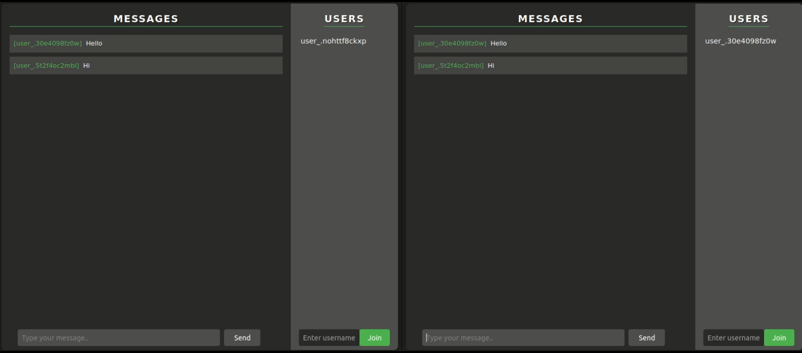

# chat-room


[](https://app.netlify.com/sites/yew-chat/deploys)

A simple chat room application written in Rust powered by Yew.



## Requirements

- PubNub Account

<a href="https://dashboard.pubnub.com/signup">
	
</a>

## About PubNub

> PubNub allows you to create chat apps from scratch or add them to your existing applications. You can focus on creating the best user experience while PubNub takes care of scalability, reliability, security, and global legislative compliance.

## Get Your PubNub Keys

1. Register a new [PubNub account](https://dashboard.pubnub.com/signup/).

1. Copy your unique PubNub keys from the [PubNub Developer Portal](https://admin.pubnub.com/).

1. Click Apps, then **Create New App**.

1. Give your app a name, and click **Create**.

1. Click your new app to open its settings, then click its keyset.

1. Copy the Publish and Subscribe keys and paste them into your app as specified in the next step.

## Building and Running

1. You'll need to run the following commands from your terminal.

1. Fork/Clone the GitHub repository.

	```bash
	git clone https://github.com/wiseaidev/chat-room
	```

1. Navigate to the application directory.

	```bash
	cd chat-room
	```

1. Set your pub/sub keys as environment variables:

	```sh
	export SUB_KEY_0="your-sub-key"
	export PUB_KEY_0="your-pub-key"
	```

1. Run the client:

	```sh
	trunk serve --port 3000
	```

Navigate to http://localhost:3000 to explore the app.

## License

This project and the accompanying materials are made available under the terms and conditions of the [` Apache License Version 2.0`](https://github.com/wiseaidev/chat-room/blob/main/LICENSE).
