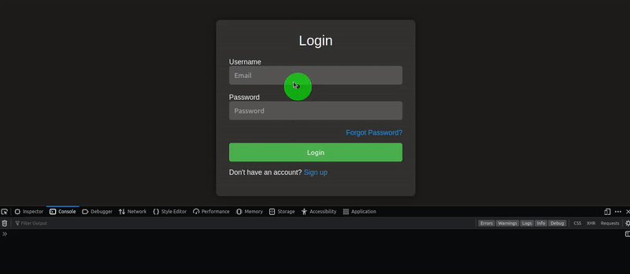

# Yew Form


[](https://app.netlify.com/sites/yew-form/deploys)

A simple login form powered by Yew.



## Building and Running

1. Fork/Clone the GitHub repository.

	```bash
	git clone https://github.com/wiseaidev/yew-form
	```

1. Navigate to the application directory.

	```bash
	cd yew-form
	```

1. Run the client:

	```sh
	trunk serve --port 3000
	```

Navigate to http://localhost:3000 to explore the app.

## License

This project and the accompanying materials are made available under the terms and conditions of the [` Apache License Version 2.0`](https://github.com/wiseaidev/yew-form/blob/main/LICENSE).