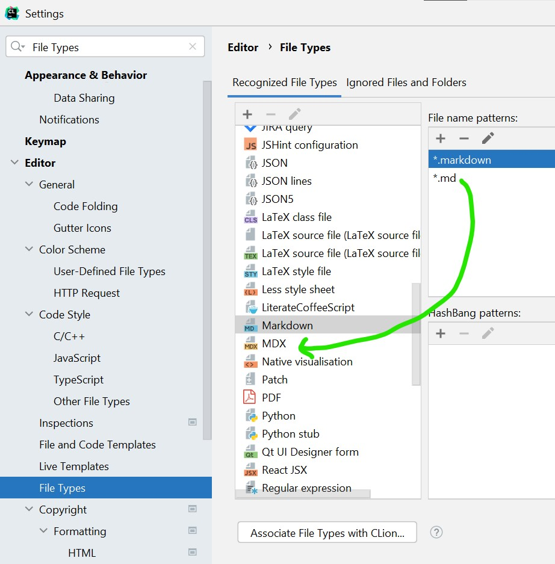

# Website

This website is built using [Docusaurus 2](https://docusaurus.io/), a modern static website generator.

## Installation

```console
npm install
```

## Local Development

```console
npm start
```

This command starts a local development server and opens up a browser window. Most changes are reflected live
without having to restart the server.
Note this only builds for English locale unlike a production build.

Documentation is written in `mdx`, a superset of markdown empowered with jsx.
JetBrains and VSCode both provide MDX plugins.

However, we name all our documentation with the `.md` suffix
because our localization tool GitLocalize doesn't support the `.mdx` file extension.
You can still enable `mdx` IDE support by associating the suffix `.md` with mdx
and deleting the original markdown association.

Here's where you can find the settings in JetBrains:



Since mdx is a superset of md, other markdown files will have the correct syntax highlighting, hotkeys, etc. 
The only downside is there will be no more live preview of other markdown files.

## Production Build

```console
npm run build
```

This command generates static content into the `build` directory and can be served using any static contents hosting service.

## Deployment

```console
GIT_USER=<Your GitHub username> USE_SSH=true yarn deploy
```

If you are using GitHub pages for hosting, this command is a convenient way to build the website and push to the `gh-pages` branch.
